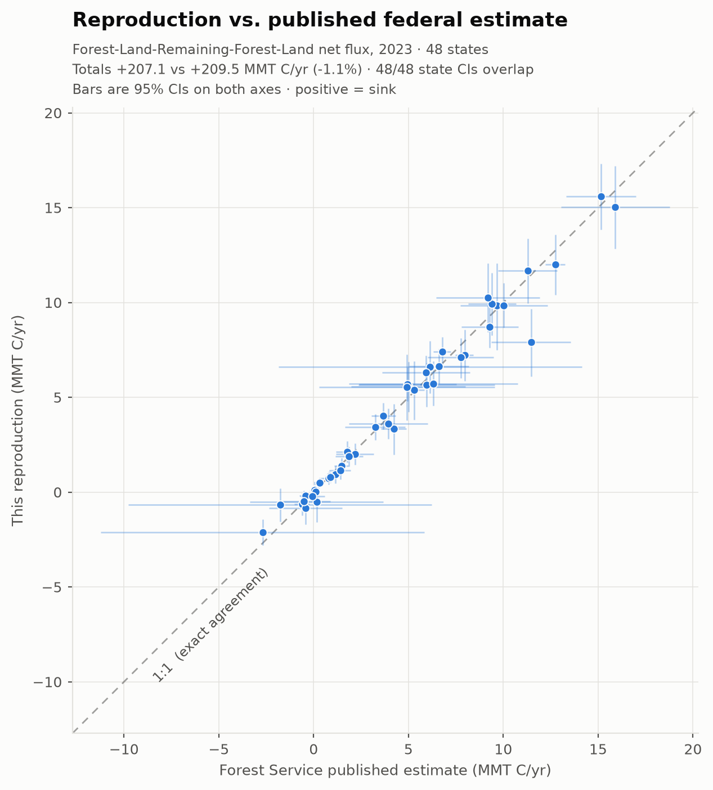
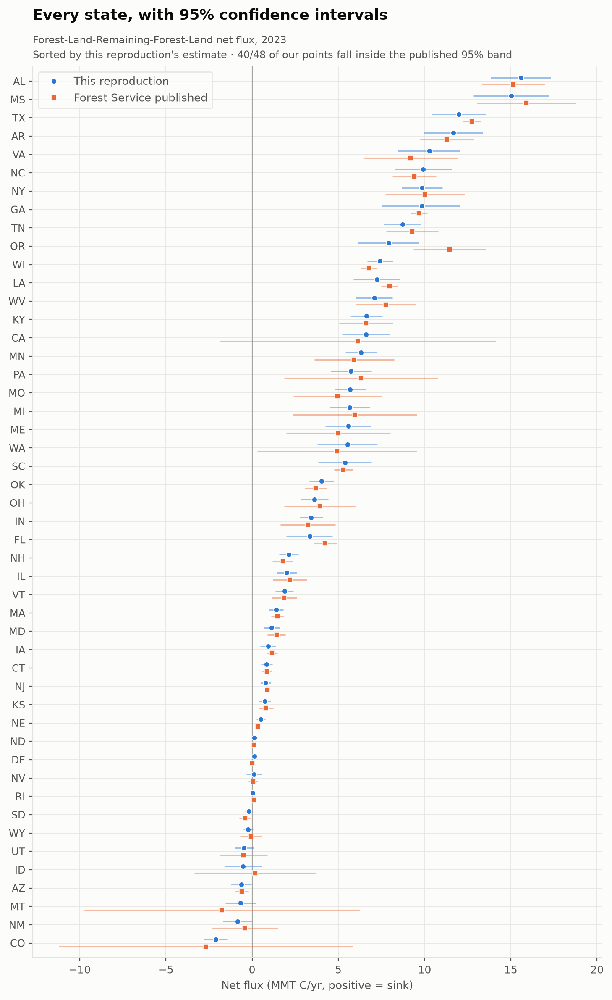

# Forest carbon in the U.S. greenhouse gas inventory — an independent, open reproduction

This repository holds **per-state forest carbon flux estimates, with 95% confidence
intervals, produced independently of the federal inventory** — plus the notebook that
compares them against the published Forest Service numbers, so you can check the
agreement yourself.

The estimates cover **Forest Land Remaining Forest Land** (the management flux on land
that was forest at both measurement dates) for **2023**, across the **48 contiguous
states**. This is the largest single component of the only net *sink* in the U.S.
national greenhouse gas inventory.

<picture>
  <source media="(prefers-color-scheme: dark)" srcset="figures/frf-vs-published-1to1-dark.png">
  
</picture>

| | |
|---|---|
| Our 48-state total, 2023 | **+207.1 MMT C/yr** |
| Forest Service published total (Walters et al. 2026) | **+209.5 MMT C/yr** |
| Difference | **−1.1%** |
| States whose 95% CI overlaps the published CI | **48 / 48** |
| States whose point estimate falls inside the published 95% band | **40 / 48** |

Positive means a **sink** (carbon moving out of the atmosphere into forests). Note that
EPA and the Forest Service both publish the opposite sign convention — see
[Sign and units](#sign-and-units-read-this-before-using-the-numbers).

A secondary cross-check against EPA's Annex 3.13 Table A-208 for **2022** — one year
earlier, the most recent *published* EPA table — gives **+5.9%**. That figure is
**versus EPA's 2022 table, not versus Walters**; most of the gap is the one-year
reference offset.

## Read the per-state detail

The single most common question is "what does this say about *my* state?" Every state's
estimate and interval is in [`data/forest_carbon_flux_ci.csv`](data/forest_carbon_flux_ci.csv),
and plotted here:

<picture>
  <source media="(prefers-color-scheme: dark)" srcset="figures/frf-by-state-dark.png">
  
</picture>

Where our interval is much *narrower* than the published one, that is not a sign we are
more certain — our uncertainty budget is **incomplete** (see
[Limitations](#limitations)).

## What is — and is not — in this repository

**Is here:** the per-state results, the published federal reference tables they are
compared against, a notebook in Python and R that reproduces the comparison and the
figures from those files, and the figure-generating script. Everything runs from the
bundled CSVs with only `pandas` and `matplotlib` — no database, no credentials, no setup
beyond `pip install -r requirements.txt`.

**Is not here: the estimator itself.** The comparison in this notebook reads finished
per-state numbers from `data/`; it does not recompute them from Forest Inventory and
Analysis (FIA) plot data. Calling it a "reproduction" refers to reproducing the
*inventory's published estimates* independently — not to re-running our estimator inside
this notebook.

The estimator is being prepared for public release as part of
**[pyfia](https://github.com/mihiarc/pyfia)**, targeted for **Q1 2027**. Until then, what
this repository lets you verify is that our numbers agree with the federal record, and
exactly which inventory evaluation each number came from — every row of
`forest_carbon_flux_ci.csv` carries its FIA `evalid`, along with the bootstrap iteration
count and random seed, so each value is pinned to a specific, re-runnable input.

`pyfia` is already public, MIT-licensed, and on PyPI today. It is the design-based FIA
estimation library this work is built on; the forest-carbon flux pipeline is what lands
in its 2.0 release.

## Quick start

```bash
pip install -r requirements.txt
jupyter lab notebooks/frf_validation_demo.ipynb   # Python
# or, in R:  rmarkdown::render("notebooks/frf_validation_demo.Rmd")
```

Both notebooks recompute every headline number above from the bundled CSVs — nothing in
them is hard-coded. The R version uses base R only for the comparison, so it needs no
Python.

```
data/    forest_carbon_flux_ci.csv          our per-state results + 95% CIs
         walters_2026_frf_net_flux_2023.csv published FS reference, 2023 (primary)
         epa_a208_2022.csv                  published EPA Annex 3.13 A-208, 2022
notebooks/  frf_validation_demo.ipynb / .Rmd
figures/    make_figures.py                 regenerates the figures above
```

See [`data/README.md`](data/README.md) for column-level provenance.

## How a state inventory team might use this

- **As an independent check** on the forest-land numbers in your own inventory, or on
  the downscaled federal figures you currently rely on — computed from public FIA data
  by a separate implementation, with its own uncertainty.
- **As a per-state uncertainty reference.** The published federal intervals and ours are
  both here, so you can see how wide the real uncertainty on a state forest sink is.
- **As a transparent method trail.** Each estimate names its FIA evaluation, so it is
  clear which inventory cycle and which plots stand behind a number.

It does **not** replace anything in your inventory today, and it is not a substitute for
the official federal record. Treat the published Forest Service and EPA figures as the
reportable numbers.

## Scope

Forest sector only, and within it only Forest Land Remaining Forest Land. **Not**
included: forest land conversion (land converted to or from forest), woodlands,
harvested wood products, non-CO₂ forest gases, or any of the non-forest LULUCF
categories (cropland, grassland, wetlands, settlements). Geographically: the 48
contiguous states. Interior Alaska, Hawaii, and the territories are estimated by
different methods and are out of scope here.

This is a reproduction of already-published methods, not new science, and it is
deliberately scoped to complement rather than duplicate the Forest Service's own
research program.

## Limitations

Stated up front rather than in a footnote:

- **The confidence intervals are a lower bound on width.** They cover sampling
  uncertainty plus published parameter uncertainty for the litter and soil organic
  carbon pool models. They do **not** yet include tree-biomass model (NSVB) parameter
  uncertainty, which drives most of the flux. A fuller budget would be wider.
- **The intervals are on flux, not on stocks.**
- **CI overlap is a coarse agreement test.** Two intervals can overlap while the point
  estimates differ substantially, and where the published interval is very wide, overlap
  is close to automatic. Read "48/48 overlap" as *no gross disagreement*, not as tight
  agreement. The 40/48 in-band figure is the stricter test.
- **Harvested wood products are not in the A-208 comparison**, so that cross-check is
  not like-for-like across the full forest sector.
- Where our point estimate sits outside the published band, it is concentrated in
  disturbance-affected states; we attribute it to a smoothing asymmetry in how the
  reference series handles disturbance years.

## Sign and units — read this before using the numbers

1. **Sign.** Our files use **positive = sink**. EPA and the Forest Service both publish
   **negative = sink**. The notebooks flip the reference into our convention and label
   every value; if you join these files to anything else, check the convention on both
   sides first.
2. **Units.** MMT C per year (million metric tons of carbon), *not* CO₂ equivalent.
   Multiply by 44/12 for CO₂e.
3. **A mislabel in the source archive.** In the bundled Walters uncertainty file, the
   column headers read "MMT CO2 Eq." but the values are **MMT C**. Confirmed against
   Walters' main flux table (Alabama: −55.56 CO₂e × 12/44 = −15.15 MMT C). No CO₂→C
   conversion is applied to those columns.
4. **Do not validate by summing.** Independently rounded, disaggregated state estimates
   are not expected to sum to a published national total.
5. **Stocks are as of January 1**; an empty cell means *not estimated*, not zero.

## Credit

This work exists because of Forest Inventory and Analysis and Forest Service Research &
Development. The inventory, the plot network, and every carbon model used here are their
work; this is an independent implementation of published federal methods, built to put
that science in front of more people.

- **Wear, D.N.; Coulston, J.W.** 2015. From sink to source: Regional variation in U.S.
  forest carbon futures. *Scientific Reports* 5:16518. — the cohort-following flux
  framework this estimator implements.
- **Coulston, J.W.; Wear, D.N.; Vose, J.M.** 2015. Complex forest dynamics indicate
  potential for slowing carbon accumulation in the southeastern United States.
  *Scientific Reports* 5:8002.
- **Woodall, C.W.; et al.** 2015. The U.S. forest carbon accounting framework: stocks and
  stock change, 1990–2016. USDA Forest Service GTR-NRS-154.
- **Westfall, J.A.; et al.** 2023. A national-scale tree volume, biomass, and carbon
  modeling system for the United States (NSVB). USDA Forest Service GTR-WO-104.
- **Domke, G.M.; et al.** 2016 (forest floor) and 2017 (soil organic carbon) — the pool
  models and the published parameter uncertainty used in our intervals.
- **Walters, B.F.; Domke, G.M.; Greenfield, E.J.; Smith, J.E.; Ogle, S.M.; Knott, J.A.**
  2026. Greenhouse gas emissions and removals from forest land, woodlands, urban trees,
  and harvested wood products in the United States, 1990–2023: Estimates and quantitative
  uncertainty for individual states, regional ownerships, National Forests, and Tribal
  ownership. Fort Collins, CO: Forest Service Research Data Archive.
  https://doi.org/10.2737/RDS-2026-0031 — **the primary reference compared against here.**
- **Domke, G.M.; Walters, B.F.; Knott, J.A.; Nash, J.M.; Smith, J.E.; Ogle, S.M.** 2026.
  Greenhouse gas emissions and removals from forest land, woodlands, and harvested wood
  products in the United States, 1990–2024. Resource Bulletin WO-103. Washington, DC:
  USDA Forest Service. https://doi.org/10.2737/WO-RB-103
- **U.S. EPA.** *Inventory of U.S. Greenhouse Gas Emissions and Sinks*, Chapter 6 and
  Annex 3.13.
- **pyfia** — https://github.com/mihiarc/pyfia — the open FIA estimation library
  underneath this work.

## License

Code (notebooks, scripts): **MIT** — see [LICENSE](LICENSE).
Data tables in `data/`: **CC BY 4.0** — see [LICENSE-data](LICENSE-data). The bundled
federal reference tables are U.S. Government works, redistributed here unmodified except
for reshaping into CSV; cite the original sources above.

Produced by [CTrees](https://ctrees.org).
